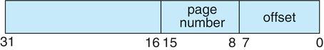
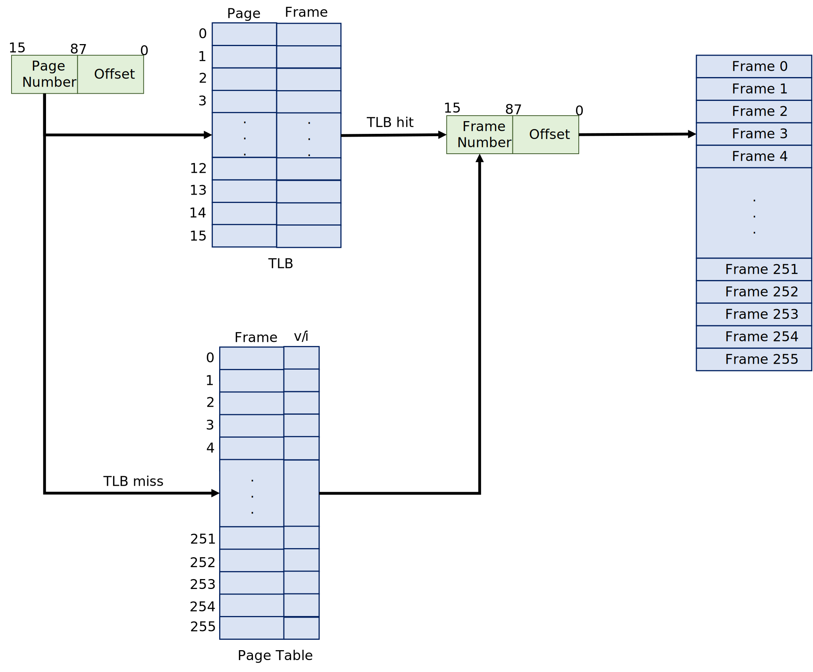
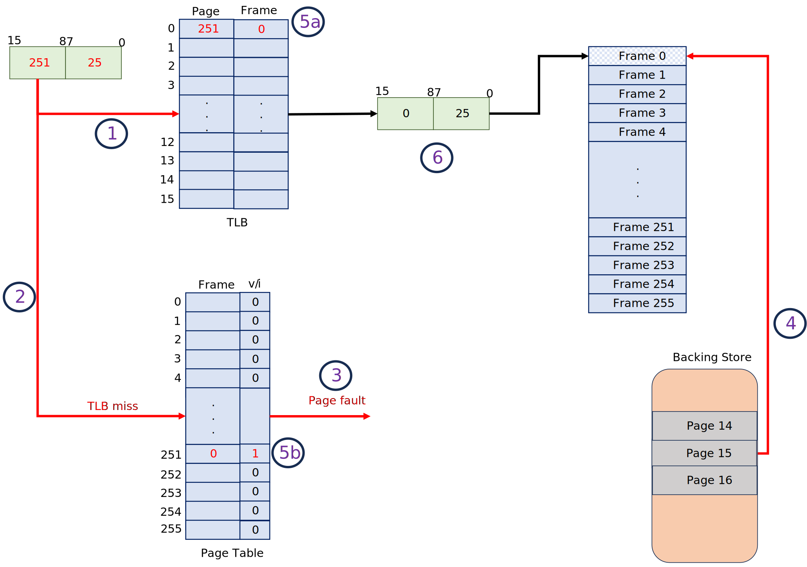

# Final Project: Designing a Virtual Memory Manager

This project consists of writing a program that translates logical to physical addresses for a virtual address space of size 2<sup>16</sup> 
 = 65,536 bytes. Your program will read from a file containing logical addresses and, using a TLB and a page table, will translate each logical address to its corresponding physical address and output the value of the byte stored at the translated physical address. Your learning goal is to use simulation to understand the steps involved in translating logical to physical addresses. This will include resolving page faults using demand paging, managing a TLB, and implementing a page-replacement algorithm.


## Description

Your program will read a file containing several 32-bit integer numbers representing logical addresses. However, you only need to be concerned with 16-bit addresses, so you must mask the rightmost 16 bits of each logical address. These 16 bits are divided into (1) an 8-bit page number and (2) an 8-bit page offset. Hence, the addresses are structured as shown as:

<div style="text-align:center;"></div>

Other specifics include the following:

* 2<sup>8</sup> entries in the page table
* Page size of 2<sup>8</sup> bytes
* 16 entries in the TLB
* Frame size of 2<sup>8</sup> bytes
* 256 frames
* Physical memory of 65,536 bytes (256 frames × 256-byte frame size)

Additionally, your program needs to be concerned only with reading logical addresses and translating them to their corresponding physical addresses. You do not need to support writing to the logical address space.

### Address Translation

Your program will translate logical to physical addresses using a TLB and page table as outlined in Section 9.3. Extract the page number from the logical address, then consult the TLB. In the case of a TLB hit, obtain the frame number from the TLB. In the case of a TLB miss, consult the page table. In the latter case, get the frame number from the page table, or a page fault occurs. A visual representation of the address-translation process is provided below.

<div style="text-align:center;"></div>

### Handling Page Faults

Your program will implement demand paging. The file **BACKING_STORE.bin** represents the backing store, a binary file of size 65,536 bytes provided with this project. When a page fault occurs, you will read a 256-byte page from the file **BACKING_STORE** and store it in an available page frame in physical memory. Since all frames are invalid at the beginning of your program, you should start adding at frame 0 in physical memory.

For example, Let's assume we get our first logical address, resulting in a page number of 251. At the start, the TBL is empty, and all the page table entries are invalid (i.e., set to 0 - see figure below). The steps to map the logical address to the physical address are as follows (**NOTE: steps correlate to steps shown in the figure below**):

1. The TBL is consulted for the frame number. This results in a TBL miss!
2. Next, the page table is consulted.  
3. This results in a page fault!
4. Page 251 is located in the  **BACKING_STORE** at byte address `251*256 = 64256` (remember that pages begin at 0 and are 256 bytes in size) and loaded into Frame 0, which is the next available frame. Fill the frame starting at 0, 1, 2, ..., and 255. This works since the size of the logical space is the same as the physical space.
5. Update
   <ol type="a"><li>The TBL table.</li><li>The page table.</li></ol>
6. Access the memory located at frame 0 and offset 25 (i.e., physical address 25). 

The TLB or the page table will resolve subsequent accesses to page 251.

<div style="text-align:center;"></div>

You will need to treat **BACKING_STORE.bin** as a random-access file so that your program can randomly seek to certain file positions for reading. Use the standard C library functions for performing I/O, including <span style="color:blue;">fopen()</span>, <span style="color:blue;">fread()</span>, <span style="color:blue;">fseek()</span>, and <span style="color:blue;">fclose()</span>.

The size of physical memory is the same as that of the virtual address space—65,536 bytes—so you do not need to be concerned about page replacements during a page fault.

### Managing the TBL

The TBL contains 16 entries, as specified earlier.  This means that when a TBL miss occurs, the TBL must be updated with the latest (page number, frame number) pair.  Initially, the TBL is empty, and updating it will be simple.  Just add the (page number, frame number) pair in the next available spot in the table.  When the table becomes full,  a decision needs to be made as to which entry in the table to replace.  The most straightforward strategy is to use a FIFO replacement strategy.  That is, treat the TBL as a circular queue and replace the entry at the head of the queue.  You may also use an LRU replacement strategy as well.

## Test File

The file **address.txt** provided with this project contains integer values representing logical addresses ranging from 0 to 65535 (the virtual address space size). Your program will open this file, read each logical address, translate it to its corresponding physical address, and output the value of the signed byte at the physical address.

## How to Approach the Implementation

First, write a simple program with two functions, one that extracts the page number and one that extracts the offset based on:

<div style="text-align:center;"></div>

The easiest way to do this is by using the operators for bit-masking and bit-shifting. 

```
Page Number = (logical_address >> 8) & 0x00FF
Offset = logical_address & 0x00FF
```

You are ready to begin once you can correctly establish the page number and offset from an integer number. Use the logical addresses provided in the file **address.txt**. The project also includes a file called **correct.txt** that provides the correct results for each of the first fifty (50) addresses in **address.txt**. Use the **correct.txt** file to verify that your functions are correct. 

Initially, you should bypass the TLB and use only a page table. You can integrate the TLB once your page table is working correctly. Remember, address translation can work without a TLB; the TLB just makes it faster. In this implementation, accessing the TBL will be done using a *linear search* and will be slow. However, the point of the exercise is not speed but to simulate the address-translation algorithm.

When you are ready to implement the TLB, use the strategy discussed in the section *Managing the TBL*.

## How to run your program

Your program should run as follows:

<p><span style="background-color:#EAEAEA; font-family:courier,monospace; padding: 5px; border-radius: 5px;">./a.out addresses.txt</span></p>
 

Your program will read in the file addresses.txt, which contains 1,000 logical addresses ranging from 0 to 65535. Your program translates each logical address to a physical address and determines the contents of the signed byte stored at the correct physical address. (Recall that in the C language, the <span style="color: blue;">char</span> data type occupies a byte of storage, so we suggest using char values.)

Your program is to output the following values:

1. The logical address  (the integer value read from **addresses.txt**).
2. The corresponding physical address (what your program translates the logical address to).
3. The signed byte value stored in physical memory at the translated physical address.

Using the following format:

<p> <span style="background-color:#EAEAEA; color:purple; padding: 5px; border-radius: 5px;">logical address, physical address, signed byte value</span></p>

For example, 

<p> <span style="background-color:#EAEAEA; color:purple; padding: 5px; border-radius: 5px;">1234, 2514, -5</span></p>

The file **correct.txt**, which contains the correct output values for the 50 addresses in the file **addresses.txt**, should be used to determine if your program is correctly translating logical to physical addresses.

<p style="color:red;"><u>NOTE:</u> your output must match exactly as provided above for each logical address in <strong>addresses.txt</strong>. There should be a single space after each comma (,).</p>

## Statistics

After completion, your program is to report the following statistics:

1. Page-fault rate—The percentage of address references that resulted in page faults.
2. TLB hit rate—The percentage of address references resolved in the TLB.

Since the logical addresses in **addresses.txt** were generated randomly and do not reflect any memory access locality, do not expect to have a high TLB hit rate.

## Submission Requirements

Click the <span style="background-color:green;color:white;">Use as template</span> button to copy the repo to your GitHub account and **clone** your repo on **your VM**. You should commit your code as you work on your program and push it systematically to your repo.  **Your finalized product should be on your Github repo**.

<p style="color:purple">Your submission must include a makefile that creates the executable by default (i.e. when make is run on the command line without any arguments).  It should also include a clean command that cleans all .o and executable files.</p>

After completing your work, submit your Github repo link on Blackboard. Your repo should show no submissions after the submission deadline. Any submissions after the deadline will result in an immediate zero (0) on the assignment. If your **program does not compile, you will receive a zero (0) on the assignment**. A rubric is provided with the project on Blackboard.


